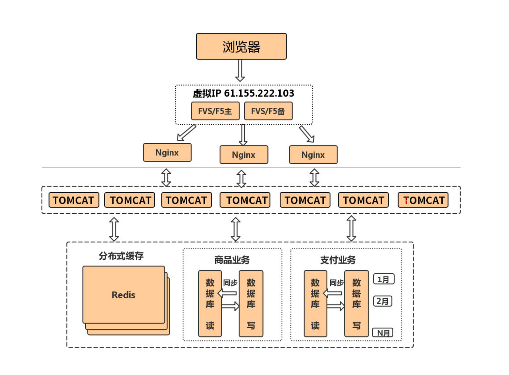

- 初始化单机架构：应用与数据一体模式

- 第⼀次演进：应用与数据分离模式

- 第⼆次演进：缓存与性能的提升
  - 客户端浏览器缓存
  - 应用服务器本地缓存
  - 分布式缓存

- 第三次演进：服务器集群处理并发

  Nginx并发⽀持5w，keepalive 65s，Tomcat的并发建议配置1000-2000

  session共享问题：中⼼化

- 第四次演进：数据库读写分离
  - 主从复制：主库（master）主要用来写入数据，然后通过同步binlog 的方式，将更新的数据同步到从库（slave）中。
  - 数据同步技术：
    - 同步复制
    - 异步复制
    - 半同步复制

- 第五次演进：数据库按业务分库

- 第六次演进：把⼤表拆分为⼩表

- 第七次演进：使⽤LVS或F5来使多个Nginx负载均衡

Nginx：7层

Lvs：4层

- 第⼋次演进：通过DNS轮询实现机房间的负载均衡

DNS不会帮你做服务的验证，DNS要做多级的缓存加⼊或去掉IP的时间都会很⻓

- 第九次演进：引⼊NoSQL数据库和搜索引擎等技术

like 'abc%def'，提前放⼊到ES、Solr，Redis会出现雪崩：击穿、服务挂掉

- 第⼗次演进：⼤应⽤拆分为⼩应⽤

- 第⼗⼀次演进：复⽤的功能抽离成微服务

- 第⼗⼆次演进：引⼊企业服务总线ESB屏蔽服务接⼝的访问差异

- 第⼗三次演进：引⼊容器化技术实现运⾏环境隔离与动态服务管理

- 第⼗四次演进：以云平台承载系统

