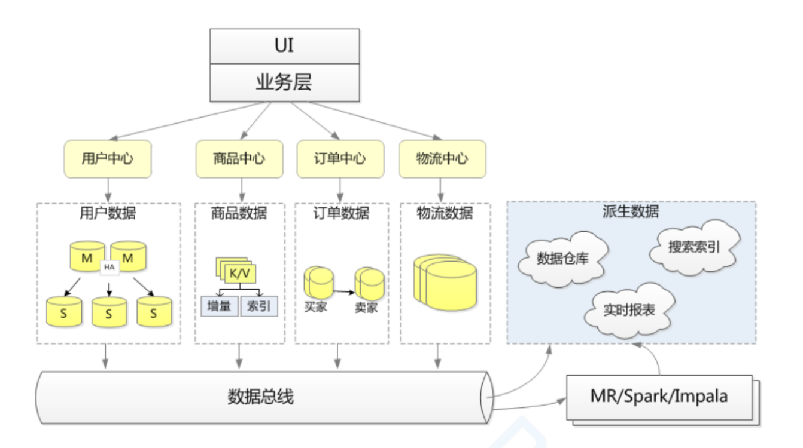

## 什么是架构师

## 架构师的使命和责任

1. 兼容过去问题：历史数据和业务的兼容，老系统过渡
2. 解决当前问题：新需求和业务功能的扩展
3. 解决未来问题：不要过度设计
    - 充分分析：时间成本、人力成本、机会成本
    - 未来 2-3 年用户规模的扩大程度
    - 未来 2-3 年现有用户的自我成长和进化方向
    - 竞争对手商业竞争的残酷性
    - 未来 2-3 年技术栈的更新迭代
    - 研发团队的自身因素

## 架构师的工作

1. 制定架构设计的目标：
    - 高可用性
    - 高可扩展性
    - 低成本
    - 多快好省

## 制定架构质量要求

- 系统质量
    - 可变性
    - 可观测性
- 用户质量
    - 应用性
- 运行时质量
    - 可用性
    - 互操作性
    - 可管理性
    - 性能
    - 可靠性
    - 可扩展性
    - 安全性
- 设计质量
    - 概念完整性
    - 可维护性
    - 可重用信

## 架构设计方法论和原则

- 可用性
    - N + 1 原则：任意节点不要是单机
    - 版本可以回退
    - 功能可开关
    - 使用成熟的技术
- 可扩展性
    - 单一责任原则
    - DID 原则
    - 容错设计
    - 可监控
    - 多维度拆分
- 成本
    - 采用同质化硬件

## 架构层级

### 业务架构设计方法与原则

业务架构的设计原则

1. 业务平台化
    1. 业务平台化，相互独立。如交易平台、仓储平台、物流平台、支付平台、广告平台
    2. 基础业务下沉，可复用。如用户、商品、类目、促销
2. 核心业务、非核心业务分离
    1. 核心业务要精简，利于稳定
    2. 非核心业务多样化。如主交易服务、通用交易服务
3. 区分主流程、辅流程
    1. 运行时优先保证主流程的顺利完成
    2. 辅流程采用后台异步的方式。避免辅流程的失败导致主流程的回滚。如：下单时，同步调用快照，异步通知台账、发票
4. 隔离不同类型的业务

业务架构设计实例

### 应用架构设计方法与原则

应用架构设计原则：

1. 稳定性原则
    1. 一切以稳定为中心
    2. 架构尽可能简单、清晰
    3. 不过度设计
2. 解耦/拆分
    1. 稳定部分与易变部分分离
    2. 核心业务与非核心业务分离
    3. 电商主流程与辅流程分离
    4. 应用与数据分离
    5. 服务与实现细节分离
3. 抽象化
    1. 应用抽象化：应用只依赖服务抽象，不依赖服务实现细节、位置
    2. 数据库抽象化：应用只依赖逻辑数据库，不需要关心物理库位置和分片
    3. 服务抽象化：应用虚拟化部署，不需要关心实体机配置，动态调配资源
4. 松耦合
    1. 跨域调用异步化：不同业务域之间尽量异步解耦
    2. 非核心业务尽量异步化
    3. 必须同步调用时。需要设置超时时间和任务队列长度
5. 容错设计
    1. 服务自治：服务能彼此独立修改、部署、发布和管理，避免引发连锁反应
    2. 集群容错：应用系统集群，避免单点
    3. 多机房容灾：多机房部署，多活

应用分层：

- 表现层
- 业务层
- 服务层
- 资源层

应用架构的分解设计原则：

- 水平扩展（复制）
    - 应用系统：多集群，提高并发能力
    - 数据库：读写分离
- 垂直拆分（不同业务拆分）
    - 应用系统：按业务域划分系统
    - 数据库：按业务分库
- 业务分片（同业务拆分）
    - 应用系统：按功能特点分开部署
    - 数据库：分库分表，提高数据容量
- 水平拆分（稳定与易变分离）
    - 应用系统：服务分层，功能与非功能分开
    - 数据库：冷热数据分离，历史数据分离

应用架构的依赖设计原则：

- 依赖稳定部分
    - 稳定部分不依赖易变部分
    - 易变部分可以依赖稳定部分
    - 要求：避免循环依赖
- 跨域弱依赖
    - 跨业务域调用时，尽可能异步弱依赖
- 服务基本依赖
    - 基本服务不能向上依赖流程服务
    - 组合服务、流程服务可以向下依赖基本服务
    - 条件：基本服务稳定
- 非功能性服务依赖
    - 非功能性服务不依赖功能性服务
    - 功能性服务可依赖非功能性服务
    - 条件：非功能性服务稳定
- 平台服务依赖
    - 平台服务不依赖上层应用
    - 上层应用可依赖平台服务
    - 条件：平台服务稳定
- 核心服务依赖
    - 核心服务不依赖非核心服务
    - 非核心服务可依赖核心服务
    - 条件：核心服务稳定

应用架构的服务设计原则：

- 无状态
    - 尽可能不要把状态数据保存在本机
    - 接口调用幂等性
- 可复用
    - 复用粒度是有业务逻辑的抽象服务，不是服务实现细节
    - 服务应用只依赖于服务抽象
- 松耦合
    - 跨业务调用，尽可能异步解耦
    - 必须同步调用时，设置超时和队列大小
    - 相对稳定的基本服务与易变流程服务分层
- 可治理
    - 制定服务契约
    - 服务可降级
    - 服务可限流
    - 服务可开关
    - 服务可监控
    - 白名单机制

应用架构设计实例

### 数据架构设计方法与实现

数据架构设计原则：

1. 统一数据视图
    1. 保证数据的及时性、一致性、准确性、完整性
2. 数据、应用分离
    1. 应用系统只依赖逻辑数据库
    2. 应用系统不直接访问其他宿主的数据库，只能通过服务访问
3. 数据异构
    1. 源数据和目标数据内容相同时，做索引异构
    2. 内容不同时，做数据库异构。如订单买家库和卖家库
4. 数据读写分离
    1. 访问量大的数据库做读写分离
    2. 数据量大的数据库做分库分表
    3. 不同业务域数据库做分区隔离
    4. 重要数据配置备库
5. 用 MySQL 数据库
6. 合理使用缓存

典型的数据架构实例：

典型的大数据平台架构应用

### 技术架构设计方法与原则

系统运行时原则：

1. 可监控
    1. 服务的 TPS 和 RT 是否符合 SLA
    2. 是否超出预期流量
2. 应用可回滚，功能可降级
3. 在线扩容
4. 安全保证
    1. 确保系统的保密性和完整性
    2. 具有足够的防攻击能力
5. 可容错
    1. 核心应用要求多活，避免单点设计，并且自身有容错和修复能力。故障时间 TTR 小
6. 可故障转移
    1. 多机房部署，发生故障时，能及时切换

系统部署原则：

1. N + 1 原则
    1. 确保为故障多搭建一套系统，避免单点问题。例如：多机房部署、应用系统集群、数据库注备
    2. 功能开发与运维分开。系统开发完成后，交给专业的运维团队管理和运营
2. DID 原则
    1. 设计 20 倍的容量（Design）
    2. 实现 3 倍的容量（Implement）
    3. 部署 1.5 倍的容量（Deploy）

3. 支持灰度发布
4. 虚拟化部署
    1. 虚拟机部署：二级系统、三级系统采用虚拟机部署，节省资源和管理成本
    2. 虚拟化部署：一击应用服务器采用虚拟化部署
5. 业务子网
    1. 机房部署以业务域划分：基本服务和数据库，相同业务域的服务器部署在一起；不同业务域的服务器物理隔离

技术架构：

**⽇均亿级流量应对⽅案**

系统准备阶段

**⼤流量⾼并发过程中的流量应对措施**

**架构设计总结**

## 架构师需要具备的技术栈能⼒

1. 需要的转变

⼯作态度上

技术⽅⾯

- 语⾔基础：JVM、GC、IO、类加载、并发多线程、框架、AOP、IOC、线程安全，

- 脚本语⾔：shell、js、python

- 架构设计：要素、模式、架构演进

- 开发⼯具：IDE(Eclipse,IDEA)，Git、Svn、Jenkins、Maven、Gradle、JIRA、Wiki

- 负载均衡：DNS、Nginx、F5、LVS、HAProxy，（HA：keepalived）

- 设计模式

- 数据结构与算法

- 运维：监控、⽇志
- 测试

- 分布式服务：分布式理论、

- 微服务：API⽹关、Netty

- 虚拟化：Docker、IaaS、PaaS、SaaS、k8s

- 中间件：容器、MQ、缓存、数据库、NoSQL

- ⼤数据：ETL

还要关注⽅案评估：评估各种⻛险

尤其发布阶段要进⾏深⼊⼀个关注

2. 在实际⼯作中如何进⾏系统架构

- 先做背景调查
    - 系统所⽤的技术栈
    - 团队管理的流程（这⾥是和项⽬经理沟通的地⽅）
    - 需求的开发模式：基于传统的还是基于敏捷（这⾥就是和产品沟通的地⽅）
    - 系统所处的架构阶段
    - 和业务沟通了解业务所⾯临的技术难题：业务⼈员、BOSS、客户
    - 寻找业务的复杂度的点
        - 什么叫复杂度
            - ⼀个系统到底问题来源是哪⾥
            - 复杂度的来源
                - ⾼性能
                - ⾼可⽤
                - 可扩展性
                - 低成本
                - 安全

- 知道问题本身
    - 制定⽅案
        - 时间成本、技术成本、应该采⽤最适合或能最快速解决问题的⽅式
        - ⼀定要有备选⽅案：3-5个为佳
    - 评估和选择
        - 最简派：基于时间的
        - 最⽜派：炫技，甲⽅项⽬
        - 最熟派：⽤于成本⽅⾯
        - 领导派：权衡利弊
            - 业务也不⼀定全⾯理解
            - DID、N+1
            - 在没有明确数据节点和时间成本要求的情况下，⼀般不会有最真实的意图和决策的
            - 数据量化很重要

- 实施

- 优化

- PDCA

3. 架构师应该要掌握的管理能⼒

- 专业的影响⼒
    - ⽅法论的建设能⼒
    - 知识的传播
- 关系技能
    - 沟通
    - 协商
    - 领导⼒
    - 政治
- 个⼈技能
    - 激情
    - 透明化：让别⼈清晰的知道你的意图
    - 境的切换
- 商务技能
    - 认知
    - 创新
- 项⽬规划和管理的能⼒

4. **架构师的职业发展及⾃我成⻓**

- 掌握完整的架构知识体系
- 获取项⽬经验和最佳实践，知⾏合⼀。不在其位不谋其政，你永远得不到锻炼
- 锻炼⾃⼰的抽象能⼒
- 要学会表达⾃⼰