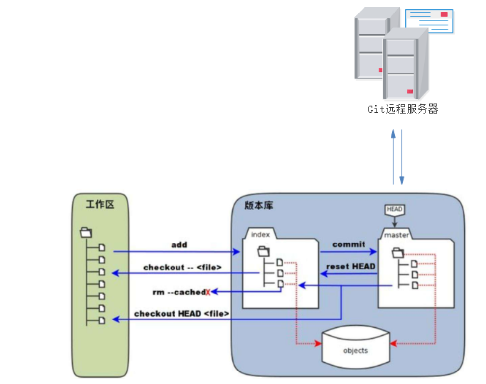

## Git 介绍

Git 是一个开源的分布式版本控制系统。

作用：
- 代码共享
- 信息追踪
- 版本回溯


GIT与SVN的区别：

- Git 是分布式的，SVN 不是
- Git 把内容按元数据(修饰数据的数据)方式存储，而 SVN 是按文件
- Git 分支和 SVN 的分支不同
- Git 没有一个全局的版本号，而 SVN 有
- Git 的内容完整性要优于 SVN

## Git 相关概念

1. 工作区

   就是你平时存放项目代码的地方。
   位置：一个文件夹通过git init 设置成一个git可以管理的文件夹时，这个文件夹里的内容（除去.git文件夹）就是工作区。

2. 暂存区

   stage 或 index。是用来暂时存放工作区中修改的内容，可以理解为一个中转站。
   位置：一般存放在 .git 目录下的 index 文件（.git/index）中，所以我们把暂存区有时也叫作索引（index）。
   说明：

   - 只是一个文件
   - 包含在版本库中
   - 为什么需要暂存区：
     - 如果没有暂存区，如果想要提交文件就需要一个个修改然后，提交，比较麻烦，但是有了暂存区就可以一次性将所需要的文件从暂存区接修改后提交。
     - 如果没有暂存区，你修改的文件只可以立刻保存到版本库中，但是这样很容易对别人的工作造成影响

3. 仓库区

   安全存放数据的位置，这里面有你提交到所有版本的数据。其中 HEAD指向最新放入仓库的版本。就是工作区有一个隐藏目录 .git，它不算工作区，而是 Git 的版本库

.git 目录下的文件：

```bash
.
├── COMMIT_EDITMSG
├── FETCH_HEAD
├── HEAD
├── ORIG_HEAD
├── config
├── description
├── hooks
├── index
├── info
├── logs
├── objects
├── packed-refs
└── refs
```

说明：

- HEAD：指向最新放入仓库的版本
- index：暂存区
- objects：是 git 对象库，是用来存储各种创建的对象以及内容.

## Git操作



1. 提交文件

   - `git add filename`：将文件从工作区添加到暂存区
   - `git commit -m 'add filename'`：将暂存区的变更提交到本地仓库
   - `git push origin master`：将本地仓库推送到远程仓库

   ```bash
   touch filename
   echo "1" > filename
   git add filename
   git commit -m 'add filename'
   git push origin master
   ```


2. 撤销回退文件

   - `git checkout filename`：从工作区撤销

     ```bash
     echo "2" > filename
     git checkout filename  # 也可以用 git restore filename
     ```

   - `git reset HEAD filename`：从暂存区撤销添加

     ```bash
     echo "2" > filename
     git add filename
     git reset HEAD filename # 也可以用 git restore --staged filename
     ```

   - `git checkout HEAD filename`：从 HEAD 区恢复 filename 文件到暂存区和工作区

     ```bash
     echo "2" > filename
     git checkout HEAD filename
     ```

   - `git reset --hard head^`：从本地仓库回退一个版本

     ```bash
     git reset --hard head^
     ```

   - `git rm filename`：从暂存区删除文件，**同时工作区不需要这个文件**

   - `git rm --cached filename`：从暂存区删除文件，**同时工作区需要这个文件，但是不需要被版本控制**

     ```bash
     touch filename
     git add filename
     git rm --cached filename
     ```


git reset 和 git restore 区别：

- `git reset`：通过把分支记录回退几个提交记录来实现撤销改动，会删除分支的提交历史。
- `git restore`：从暂存区或者工作区还原文件，不会修改分支。
- `git revert`：是进行新的提交，以还原其他提交所做的更改。


git pull 中 merge 和 rebase 区别：

- merge：把 origin 分支上的修改 pull 下来与本地提交合并，生成一个新节点。之前的提交记录通过分叉显示
- rebase：创建一个新的提交，不生成新节点，将两个分支合并成一个线性的提交

全局修改 pull 的命令：

```bash
git config --global --add pull.rebase true
```

多人基于同一个远程分支开发的时候，如果想要顺利 push 又不自动生成 merge commit，建议在每次提交都按照如下顺序操作：

```bash
# 把本地发生改动的文件贮藏一下
$ git stash

# 把远程最新的 commit 以变基的方式同步到本地
$ git pull --rebase

# 把本地的 commit 推送到远程
$ git push

# 把本地贮藏的文件弹出，继续修改
$ git stash pop
```
