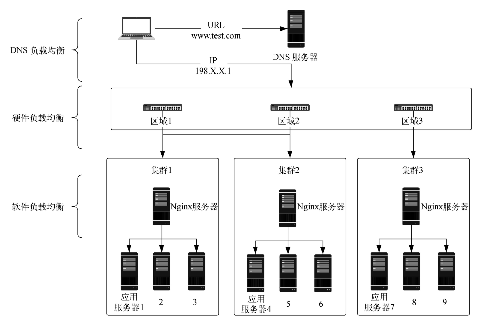
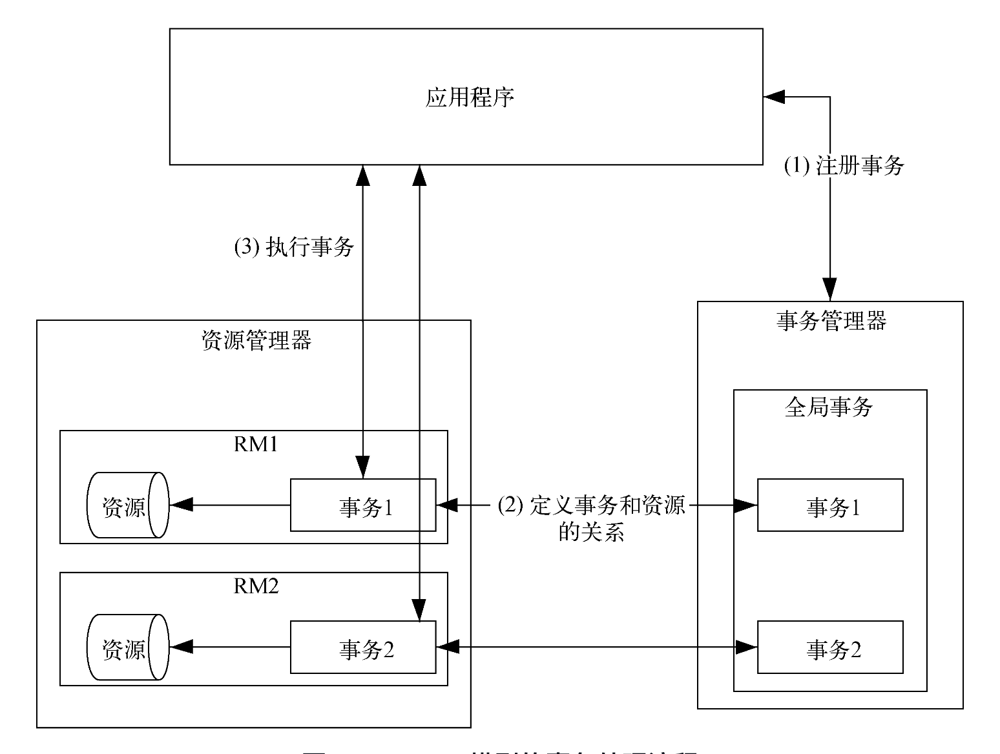

## 分布式

### 分布式架构特征

- 分布性：应用、数据拆分到不同硬件或者网络进行部署
- 自治性：分布性导致了自治性。每个应用服务都有管理和支配自身任务和资源的能力
- 并行性：自治性导致每个应用服务都是一个独立的个体，拥有独立的技术和业务，占用独立的物理资源。这种独立能够减小服务之间的耦合度，增强架构的可伸缩性，为并行性打下基础。
- 全局性：分布性使得服务和资源都是分开部署的，自治性说明单个服务拥有单独的业务和资源，多个服务通过并行的方式完成大型任务。多个分布在不同网络节点的服务应用在共同完成一个任务时，需要有全局性的考虑。说白了，就是分散的资源要想共同完成一件大事，需要沟通和协作，也就是拥有大局观。

### 分布式架构的问题

(1) 分布式是用分散的服务和资源代替几种服务和资源，所以先根据业务进行应用服务**拆分**。

(2) 由于服务分布在不同的服务器和网络节点上，所以要解决**分布式调用**的问题。

(3) 服务能够互相感知和调用以后，需要共同完成一些任务，这些任务或者共同进行，或者依次进行，因此需要解决**分布式协同**问题。

(4) 在协同工作时，会遇到大规模计算的情况，需要考虑使用多种**分布式计算**的算法来应对。

(5) 任何服务的成果都需要保存下来，这就要考虑存储问题。和服务一样，存储的分布式也可以提高存储的性能和可用性，因此需要考虑**分布式存储**的问题。

(6) 所有的服务与存储都可以看作资源，因此需要考虑**分布式资源管理和调度**。

(7) 设计分布式架构的目的是实现**高性能和可用性**。为了达到这个目的，一起来看看高性能与可用性的最佳实践，例如缓存的应用、请求限流、服务降级等。

(8) 最后，系统上线以后需要对性能指标进行有效的监控才能保证系统稳定运行，此时**指标与监控**就是我们需要关注的问题。

**拆分** -> **分布式调用** -> **分布式协同** -> **分布式计算** -> **分布式存储** -> **分布式资源管理和调度** -> **高性能和可用性** -> **指标与监控**

**拆分**：DDD

**分布式调用** ：

- 感知对方：负载均衡、API 网关、服务注册与发现、消息队列
- 信息传递：RPC、RMI、NIO

 **分布式协同**

- 互斥：
  - 集中互斥算法
  - 基于许可的互斥算法
  - 令牌环互斥算法。
- 分布式锁：
  - Redis 分布式锁
  - Zookeeper 分布式锁
  - 分段锁
- 分布式事务：
  - CAP、BASE、ACID
  - DTP 模型
  - 2PC、TCC 方案
- 分布式选举：
  - Bully 算法
  - Raft 算法
  - ZAB 算法。

 **分布式计算**

- MapReduce
- Stream

**分布式存储**

- 分布式关系数据库：分表分库、主从复制、数据扩容。
- 分布式缓存：缓存分片算法、Redis 集群方案、缓存节点之间的通信、请求分布式缓存的路由、缓存节点的扩展和收缩、缓存故障的发现和恢复。

**分布式资源管理和调度**

**高性能和可用性**

- 缓存的应用：HTTP 缓存、CDN 缓存、负载均衡缓存、进程内缓存、分布式缓存。
- 可用性的策略：动静分离、请求限流、服务降级、服务熔断。

**指标与监控**

- 性能指标：延迟、流量、错误、饱和度。

## 分布式调用

### 负载均衡

#### 负载均衡分类

- DNS 负载均衡
  - 优点：就近访问所在区域的服务器
  - 缺点：
    - 缺乏健康检查，无法应对服务器上下线
    - 缓存刷新不及时
    - 负载均衡算法相对较少
- 硬件负载均衡：NetScaler、F5（四层）、Radware、Array 
  - 优点：
    - 比 DNS 负载均衡器支持更多的负载均衡算法，比软件负载均衡器拥有更高的并发量
    - 拥有更高的稳定性，还具备防火墙、防 DoS 攻击等安全功能
    - 可以检查服务器的健康状态，如果发现某服务器故障，就将其从负载均衡组中移除

  - 缺点：
    - 价格昂贵

- 软件负载均衡：LVS、HAProxy、Ngnix（七层）
  - 优点：基于特定环境，配置简单，使用灵活，成本低廉，可以满足一般的负载均衡需求
  - 缺点：并发量受限于 Linux 系统进程打开的最大文件数

#### 反向代理和正向代理

#### 负载均衡算法

## 分布式事务

### ACID

单体事务的 ACID 特性

- 原子性（Atomicity）：事务的最终状态只有两种：全部执行成功和全部不执行，并不会出现中间状态。事务操作过程中只要有一个步骤不成功，就会导致整个事务操作回滚（取消），相当于事务没有执行。

- 一致性（Consistency）：指的是**强一致性**，换句话说就是事务中的所有操作都执行成功后，才会提交最终结果，从而保证数据一致性。

- 隔离性或独立性（Isolation）：一个事务的内部操作对数据状态进行的更改不会影响其他事务。

- 持久性（Durability）：指事务操作完成以后，此操作对数据状态的更新会被永久保存下来。更新后的数据会固化到硬件存储资源（例如数据库）上，即使系统发生故障或者网络出现问题，只要能够访问硬件存储资源，就一定能够获取这次事务操作后的数据状态。

### CAP

分布式架构引入 CAP 理论：

- 一致性（Consistency）：分布式系统中的一致性是指所有数据在同一时刻具有同样的值。
- 可用性（Availability）：可用性是指在分布式系统中，即使一部分节点出现故障，系统仍然可以响应用户的请求。
- 分区容错性（Partition tolerance）

### BASE

但CAP 理论同时至多只能支持两个属性，无法三全其美，且高并发系统追求的往往是可用性，因此对 CAP 理论进行进一步扩充，出现了 BASE 理论：

- 基本可用性（Basically Available）：指不会因为某个节点出现问题就影响用户请求，即使在流量激增的情况下，也会考虑通过限流降级的办法保证用户请求是可用的。
- 软状态（Soft state）：如果一条数据存在多个副本，则允许副本之间数据同步的延迟，能够容忍较短时间内的数据不一致。其中，数据同步正在进行但还没有完成的状态就称为软状态。
- 最终一致性（Eventually consistent）：是相对于强一致性来定义的，后者是要保证所有的数据都一致，为实时同步，而前者会容忍一小段时间的数据不一致，过了这小段时间后数据保证一致即可。有以下几种一致性。
  - 因果一致性（Causal consistency）
  - 读己之所写（Read your writes）：进程写入变量之后，可以获取自己写入的这个变量值。
  - 会话一致性（session consistency）：如果一个会话实现了读己之所写，那么数据更新后，客户端只要在同一个会话中，就可以看到这个更新的值。
  - 单调写一致性（monotonic write consistency）：当两个进程同时请求系统时，系统会保证按照进程中操作的先后顺序来执行。

分布式事务的理论变化过程遵循的核心思想是分布式系统的引入事务无法做到强一致，但每个应用、服务需要根据具体业务达到最终一致性，这也是从 ACID 特性的刚性事务，到 CAP 理论以及 BASE 理论的柔性事务的发展过程。

### DTP

然后，根据分布式事务的原理派生出 DTP 分布式事务模型：

- 应用程序（AP，Application Program）：定义完成整个事务需要的所有操作（一个或者多个操作）、根据这些操作访问对应的资源。
- 资源管理器（RM，Resource Manager）：用来管理共享资源，例如数据库实例。它同样具备两方面功能：一方面是提供访问资源所需的接口，并且支持对资源进行事务处理；另一方面是配合事务管理器完成全局事务，当应用程序在一个事务中需要操作多个资源时，资源管理器会在事务管理器注册多个事务，然后事务管理器根据注册的这些事务建立一个全局事务。
- 事务管理器（TM，Transaction Manager）：为应用程序提供注册事务的接口，针对应用程序的操作注册全局事务，然后在这个全局事务中定义原子事务（原子事务可以理解为应用程序事务中不能再拆分的操作）。同时通过 XA 协议与资源管理器直接通信，根据原子事务告诉资源管理器要操作哪些资源。通过存储、管理全局事务的内容，指挥资源管理器完成提交和回滚操作（commit 和rollback）。
- XA（Extended Architecture）。资源管理器和事务管理器之间通信遵循的协议规范，事务管理器通过它来管理和控制资源管理器上的原子事务访问资源。

在实践中不断打磨后，产生了 ：

- 2PC 解决方案（两段提交）：在一定程度上遵守 ACID 理论的刚性事务的要求，保证了强一致性
-  TCC 解决方案（Try、Confirm、Cancel）。

DTP 模型的事务处理流程：

- (1) 应用程序针对自身的业务要求在事务管理器中注册对应的操作，假设应用程序的事务包含两个操作，这两个操作在事务管理器中就显示为两个原子事务，分别是事务 1 和事务 2，这两个原子事务包含在全局事务中被统一管理。

- (2) 事务管理器通过 XA 协议将原子事务与资源管理器上的原子事务对应起来。资源管理器有多个，每个资源管理器分别控制 1 个原子事务访问相应的资源。

- (3) 完成上面两步操作后，应用程序就可以根据自身业务直接访问资源管理器中的资源了，同时事务管理器中定义的全局事务会判断其原子事务的完成情况，以此决定是提交事务还是回滚事务。

### 2PC

2PC 的全称为两阶段提交（Two Phase Commitment Protocol），是 DTP 模型的最佳实践，解决了在分布式服务或数据库场景下，同一事务对多个节点进行操作的数据一致性问题。2PC 在一定程度上遵守 ACID 理论的刚性事务的要求，保证了强一致性。2PC 中有两个概念，一个是事务协调者，对应 DTP 模型中的事务管理器，用来协调事务，所有事务什么时候准备好、什么时候可以提交都由它来协调和管理；另一个是事务参与者，对应DTP 模型中的资源管理器，主要负责处理具体事务、管理需要处理的资源。

2PC 最佳实践分为两个阶段。

- 第一阶段（准备阶段）：事务协调者（事务管理器）给每个事务参与者（资源管理器）发送准备（prepare）消息，目的是询问大家是不是都准备好了，马上就要执行事务了。事务参与者会根据自身业务和资源情况进行检查，然后给出反馈。

  只有检查通过，才能返回就绪（ready）信息。否则，事务将终止，并且等待下次询问。由于检查过程需要完成一些操作，因此需要写 redo 日志和 undo 日志，以便事务失败重试，或者失败回滚时使用。

- 第二阶段（提交阶段）：如果事务协调者接收到事务参与者检查失败或者超时的消息，会给其发送回滚（rollback）消息，否则发送提交（commit）消息。

  针对以上两种情况，处理过程分别如下。

  - 情况 1：只要有一个事务参与者反馈未就绪（no ready），事务协调者就会回滚事务。
    - a) 事务协调者向所有事务参与者发出回滚请求。
    - b) 事务参与者使用第一阶段中 undo 日志里的信息执行回滚操作，并且释放整个事务期间占用的资源。
    - c) 各事务参与者向事务协调者反馈应答（ack）消息，表示完成操作。
    - d) 事务协调者接收到所有事务参与者反馈的应答消息，即完成了事务回滚。
  - 情况 2：当所有事务参与者均反馈就绪（ready）消息时，事务协调者会提交（commit）事务。
    - a) 事务协调者向所有事务参与者发出正式提交事务的请求。
    - b) 事务参与者执行提交（commit）操作，并释放整个事务期间占用的资源。
    - c) 各事务参与者向事务协调者反馈应答（ack）消息，表示完成操作。
    - d) 事务协调者接收到所有事务参与者反馈的应答（ack）消息，即完成了事务提交。

### TCC

随着大流量、高并发业务场景的出现，对系统可用性的要求变得越来越高，这时CAP 理论和 BASE 理论逐渐进入人们的视野，柔性事务成为分布式事务的主要实现方式，TCC 作为补偿事务也位列其中。

TCC（Try-Confirm-Cancel）的核心思想是对于每个资源的原子操作，应用程序都需要注册一个与此操作对应的确认操作和补偿（撤销）操作。其中确认操作负责在原子操作执行成功时进行事务提交，补偿操作负责在原子操作执行失败时对事务进行回滚。

TCC 分为三个阶段：

- Try 阶段：负责对业务系统以及要操作的对象进行检测和资源预留。
- Confirm 阶段：负责对业务系统做确认提交。如果 Try 阶段执行成功，表明针对资源的操作已经准备就绪，此时执行 Confirm 便会提交对资源的操作。也就是说当资源准备好时，只用提交该操作执行就好了。
- Cancel 阶段：负责在业务执行错误，需要回滚时执行业务取消操作，此时就需要释放 Try 阶段预留的资源了。换句话说，是在资源操作执行失败的情况下，根据之前预留的资源情况进行回滚。

TCC 通过记录事务处理日志来保证可靠性。一旦执行 Try、Confirm、Cancel 操作时服务挂掉或者出现异常，就可以从日志中读取对应的操作阶段，对事务操作进行重试。另外如果服务存在异步情况，则可以采用消息队列的方式保持通信事务的一致。

## 分布式选举

### Bully 算法

在存活的节点中，选取节点 ID 最大（或者最小）的节点为主节点。当然 Bully 算法也适用于含主从节点的分布式系统，其分为三种消息类型。

- Election 消息：此消息用于发起选举。
- Alive 消息：对 Election 消息的回复。
- Victory 消息：竞选成功的主节点向其他节点发送的消息，告诉其他节点自己是主节点。

在使用 Bully 算法的集群中，每个节点都知道其他节点的 ID，选举过程分如下几步。

- 集群中所有节点都判断自己的 ID 是否是存活节点中 ID 最大的，如果是，就向其他节点发送 Victory 消息，声明自己是主节点。
- 否则，向比自己 ID 大的所有节点发送 Election 消息，并等待回复。
- 在给定的时间范围内，如果当前节点没有接收到其他节点回复的 Alive 消息，就认为自己是主节点，同时向其他节点发送 Victory 消息，声明自己是主节点；若接收到比自己 ID 大的节点回复的 Alive 消息，就等待其他节点发送 Victory 消息。
- 若当前节点接收到比自己 ID 小的节点发送的 Election 消息，则回复一个 Alive 消息，告知这些节点，我的 ID 更大，需要重新选举。

### Raft 算法

Raft 算法是一种投票选举算法，遵从少数服从多数的原则，规定在一个周期内获得票数最多的节点为主节点。该算法将集群节点划分为三种角色。

- Leader：领导者，也就是主节点，在一个集群中同一时刻只能有一个领导者，负责协调和管理其他从节点。
- Candidate：候选者，集群中的每个节点都有可能成为候选者，只有先成为候选者才有机会被选为领导者。
- Follower：跟随者，它会跟随领导者，不可以发起选举。

通过下面几步详细描述Raft 选举的流程。

- (1) 在集群初始化阶段，各节点加入集群中，此时所有节点均为跟随者，也就是说在最初是没有领导者的。
- (2) 集群中如果存在领导者，就会给每个跟随者发送心跳包表示自己存在，但此时集群中并没有领导者，因此需要进行选举。
- (3) 集群中所有节点都从跟随者转换为候选者，同时向其他节点发送选举请求。这里有一个选举超时控制机制（Election Timeout），用来控制节点从跟随者转换为候选者的时间，一般选取 150ms 和 300ms 之间的随机值。设置这个值的目的是避免多个跟随者同时转换为候选者。如果跟随者在选举超时控制指定的时间范围内没有接收到来自领导者的心跳包，就转换为候选者发起选举。
- (4) 由于选举超时控制的时间是一定范围内的随机数，因此其他节点接收到的选举请求是有先后顺序的，接收请求的节点回复请求发起者，是否同意其成为领导者。需要注意，在每轮选举中，一个节点只能投出一张票。
- (5) 如果有候选者获得超过一半节点的投票，那么这个候选者就会成为领导者并且宣布自己的任期。任期可以理解为一个累加的数字，例如集群中第一次选举出来的领导者，其任期为 1。领导者宣布任期以后，其他节点会转变为跟随者。领导者节点会向跟随者节点定期发送心跳包，检测对方是否存活。通常来说心跳包会按照一定时间间隔发送，跟随者接收到来自领导者的心跳包以后，会回复一个消息表示已经接收到。
- (6) 当领导者出现网络延迟或者死机时，无法发送心跳包，跟随者如果在选举超时控制容忍的时间内没有接收到心跳包就会发起选举。这表明之前领导者节点的任期到了，如果之前的任期为 1，那么再选举出来的领导者的任期就是 2。当跟随者发起新选举时，当前的领导者节点会降级为跟随者，和其他跟随者一样参与新一轮选举。

**注意**

在 Raft 算法中，如果某一次选举时出现了平票的现象，也就是两个节点获得了一样多的票数，就将任期加 1 并重新发起一次选举，直到某个节点获得更多的票数。一旦集群中选举出了领导者，客户端的写入操作就会针对领导者展开，领导者再与跟随者同步信息完成最终值的修改。

具体过程如下。

- (1) 客户端将更新信息发送给领导者，此时领导者会在本地的日志中建立一个Entry，记录这次修改。注意这个 Entry 是未提交（Uncommitted）的，即还没有进行提交操作，也就是说还没有领导者节点更新信息。
- (2) 领导者将客户端的更新信息分别提交到两个追随者中，说白了就是将这次修改的日志副本发送给两个跟随者。
- (3) 跟随者接收到更新信息后，会给领导者发送确认信息。直到接收到半数以上的确认信息后，领导者才会将客户端更新的 Entry 提交到本地的日志中保存，意思是这次更改已经发送给跟随者，并且得到半数以上的确认。与此同时，领导者还会向集群内的所有跟随者发送广播，声明这次更改已经提交了。上述整个将更新信息通知全网跟随者，并且得到确认的过程称为日志复制。
- (4) 最后，领导者告知客户端 Entry 已经提交。

上面介绍的日志复制过程不仅在更新信息时会发生，在集群初始化，选举新领导者时也会进行。领导者会将自身保存的状态信息复制到集群的其他跟随者中，这个状态信息叫作 AppendEntries。值得注意，通常是在领导者向跟随者发送心跳包的时候发送 AppendEntries。

集群中的各个节点可能位于不同的网络中，网络环境不同，就会存在网络分区的情况。由于网络问题导致集群分成了两个独立的网络，上面一个网络由领导者 1、跟随者 2、跟随者 3 组成，下面一个网络由领导者 4、跟随者 5 组成。这两个网络中的节点由于都感知不到对方的存在，因此分别在自己的网络中选举出领导者 1 和领导者 4。原本处于一个网络的集群，由于网络问题变成了两个独立的网络，并且产生了两个领导者。一个集群出现两个领导者，会破坏数据的一致性。比如当客户端告诉领导者更新信息的时候，两个领导者会分别在自己所处的网络中进行日志复制，这会造成两个网络中的数据不一致，特别是当网络问题解决后，所有节点都能互相感知到对方，此时数据又将如何处理？

两个分区领导者的选举有先后之分，因此对应的任期是不一样的。领导者 1 对应的任期为 2，而领导者 4 的任期为 1，显然领导者 1 较新。

假设此时有两个客户端，分别是客户端 1 和客户端 2，它们并不知道出现了脑裂的状况，依旧在往集群中更新数据。客户端 1 向领导者 1 更新 Value=5 以后，领导者 1 通过日志复制的方式通知其他跟随者，并获得了超过半数的确认，因此信息为Committed 状态，Value=5 更新成功。然后客户端 2 向领导者 4 发起 Value=8的更新信息，由于其无法获得网络中超过半数的节点的支持，因此此次更新一直都处于 Uncommitted 状态。

此时网络恢复正常，节点之间均可以互相感知到对方。在做心跳检测的时候，领导者 4 发现另外一个领导者 1 的任期比自己的大，因此转换为跟随者 4，然后跟随者 4 和跟随者 5 同时回滚之前的更新信息 Value=8。当领导者1 发送心跳给跟随者 4 和跟随者 5 时，会将 Value=5 的日志复制信息一并发送，在得到确认以后，跟随者 4 和跟随者 5 的信息都修改为 Value=5。通过这种方式解决了脑裂问题。

### ZAB 算法

ZAB（ZooKeeper Atomic Broadcast）是 ZooKeeper 原子消息广播协议，其设计目的是保证集群中数据的一致性。ZooKeeper 使用一个主进程处理客户端的请求，这个主进程和 Raft 算法中的领导者很像；同时还采用 ZAB 的原子广播协议，将数据的状态变化广播给集群中的其他节点，这点和 Raft 算法中的日志复制相类似。

ZAB 算法中所有来自客户端的事务请求都由一个全局服务器来协调处理，这样的服务器叫作领导者，集群中的其他服务器叫作跟随者，此外还引入了观察者（Observer）。领导者负责将客户端的事务请求转换成一个提议（Proposal），并将该提议分发给集群中的所有跟随者，之后领导者需要等待所有跟随者的反馈信息，得到超过半数跟随者的反馈以后，领导者会再次向所有跟随者发布消息，告知提议已经半数通过了，并提交和提议对应的事务请求。

ZAB 算法的选举过程会涉及四种状态，分别如下。

-  Looking 状态：即选举状态，此时集群中不存在领导者，所有节点进入选举状态。
- Leading 状态：即领导状态，此时集群中已经选出领导者，它可向其他节点广播和同步信息。
- Following 状态：即跟随状态，此时集群中已经选出领导者，其他节点进入跟随状态并且跟随领导者。
- Observing 状态：即观察状态，当前节点为观察者，保持观望并且没有投票权和选举权。

ZAB 算法在选举投票的过程中，每个节点都会记录三元组信息 (ServerID, ZXID, epoch)。其中 ServerID 表示节点 ID；ZXID 表示处理的事务 ID，它越大表示处理的事务越新；epoch 表示选举轮数，一般用逻辑时钟表示，选举的轮数越多这个数字越大。每个节点通过二元组(vote_serverID, vote_zxid) 来表明投票给哪个节点，其中 vote_serverID 表示被投票节点的 ServerID，vote_zxid 表示投票节点的事务 ID。选举的原则是 ZXID 最大的节点成为领导者，若 ZXID 相同，则 ServerID 大的节点成为领导者。

下面以含 3 个服务器的集群为例，每个服务器就是一个节点，集群初始化的选举过程如下。

- 第一步：集群初始化时，由于所有节点都没有感知到领导者的存在，因此发起选举，进行第一轮投票，即 epoch=1。由于此时还没有处理任何事物，因此 3 个节点的 ZXID 都为 0。此时每个节点都会推选自己作为领导者，并向集群中的其他2 个节点广播投票信息。按照投票的二元组 (vote_serverID,vote_zxid)，所有节点都会将自己的节点 ID 和事务 ID 发送给彼此。
- 第二步：三个节点交换信息以后发现，ZXID 都是 0，难分伯仲。于是比较ServerID，将 ServerID 较大的节点推选为领导者，所以节点 1 和节点 2 会更改投票信息。节点 1 和节点 2 将票改成 (3,0)，然后发送给集群中的其他节点，也就是选举节点 3 作为领导者。此时节点 3 的 ID 是最大的，因此没有参与投票。
- 第三步：集群中所有服务器都把票投给了节点 3，因此节点 3 当选为集群的领导者。节点 3 进入 Leading 状态，节点 1 和节点 2 作为跟随者进入 Following 状态。

完成第三步以后，领导者会向其他服务器同步信息，如果有客户端的事务请求要处理，还会发送提议信息。

从选举的整个过程来看，ZAB 算法从开始选举到完成信息同步会经历如下三个阶段。

- 发现阶段：该阶段要求集群必须选举出一个领导者，这个领导者要维护集群中的可用跟随者的列表，从而保证与跟随者节点之间通信的顺利进行。
- 同步阶段：既然发现阶段已经能够保证领导者与跟随者之间的通信，那么在这个阶段，领导者就需要同步自身保存的数据与跟随者节点中的数据，这个和 Raft 算法中的日志复制是一个意思。这个过程会用到 CAP 理论。
- 广播阶段：领导者可以接收客户端需要处理的事务请求，并以提议的形式广播给所有跟随者。

|       | 选举原则                                                     | 参与节点               | 选举过程                                                     | ·1时间 |
| ----- | ------------------------------------------------------------ | ---------------------- | ------------------------------------------------------------ | ------ |
| Bully | 节点 ID 最大的节点作为领导者                                 | 主从节点               | 从节点发现领导者无响应就发起选举                             | 短     |
| Raft  | 少数服从多数，得到票数过半的节点当作领导者                   | 领导者、候选者、跟随者 | 节点从跟随者转换为候选者参加竞选，每个节点都对候选者进行投票，票数过半的候选者当选为领导者 | 较短   |
| ZAB   | zxid 最大的节点成为领导者；若 zxid 相同，则 serverId 大的节点是领导者 | 领导者、跟随者         | 节点处在 Locking 状态时参与竞选，通过比较 zxid、serverid 来选择最佳的节点作为领导者 | 较长   |

## 分布式计算

### MapReduce

### Stream

## 分布式存储

### 分布式数据库

#### 分表分库

#### 主从复制

#### 数据扩容

## 分布式缓存

### 缓存分片算法

### Redis 集群方案

## 分布式资源管理和调度

## 高性能与可用性

### 缓存的应用

- 动静分离
- HTTP 缓存
- CDN 缓存
- 负载均衡实现动态缓存

### 可用性

- 请求限流
- 服务降级
  -  降级等级和分类：
    - 降级等级
      - 一般：服务出现网络抖动，或者服务刚刚上线还没有预热的时候就遭遇了比较大的访问量。
      - 警告：在一段时间内出现服务访问错误的情况，这种情况虽然会返回错误，但是不影响服务的整体运行，此时可以发出警告信息，运维人员会通过网络、系统、应用的参数分析如何对服务进行处理。这里可以设置一个出错率，例如5%~10%。
      - 错误：当服务的出错率增加，例如 20%~30%，或者在某一时间段出现大量超时问题的时候，就需要分析监控数据，查看是哪个服务或者数据库出现了瓶颈。这里需要人为干预，进行服务的暂停和切换。
      - 严重：服务完全不可用。需要人为干预，进行服务的替换、自动导流，甚至服务器重启。
    - 降级分类：
      - 页面降级：如果某些页面出现了访问无效的问题，就需要对其进行降级处理。
      - 读降级：在高并发场景下，数据库会成为瓶颈，当数据库的响应时间变长时，可以不去读取数据库中的数据，转而读取缓存中的数据。当分布式缓存服务器的响应时间变长时，可以读取本地缓存中的数据。如果本地缓存都出现了问题，还可以读取 CDN 缓存中保存的兜底数据。总之，无论哪一层数据读取出现了问题，都不能给用户返回冷冰冰的错误代码，而是尽量返回用户可以理解的、与业务相关的数据。
      - 写降级：在写入数据，在更新库存的时候，会出现数据库瓶颈。此时可以先在缓存中扣减库存，然后通过队列将数据同步到数据库中。
  - 降级开关分类与设计
    - 自动降级开关
      - 超时降级开关
      - 失败降级开关
      - 故障降级开关
      - 限流降级开关
    - 手动开关降级
  -  降级开关实现策略
    - 主动拉取配置
    - 发布订阅配置

服务熔断

服务不可用的现象和原因：

- 硬件故障
- 缓存问题
- 重试流量
- 调用者资源耗尽

应用隔离

- 线程池隔离
- 信号量隔离

熔断模式

## 指标与监控
