## 服务发现介绍

服务发现可能是使协同工作的微服务架构具备生产就绪能力的最重要的支持功能。Netflix Eureka是Spring Cloud支持的第一个服务发现服务器。

> 我们在严格讨论的是一种用于服务发现的服务，但不再将其称为"服务发现服务"，而是简称为"发现服务"。当提到像Netflix Eureka这样的实际服务发现实现时，将使用术语"发现服务器"。

我们将看到在使用Spring Cloud时，使用Netflix Eureka注册微服务是多么容易。我们还将学习客户端如何使用Spring Cloud LoadBalancer将HTTP请求发送到Netflix Eureka注册的实例之一。最后，我们将尝试扩展微服务的规模，并进行一些破坏性测试，以查看Netflix Eureka如何处理不同类型的故障场景。

在深入实现细节之前，我们将讨论以下主题：

- 基于DNS的服务发现的问题
- 服务发现面临的挑战
- 使用Spring Cloud中的Netflix Eureka进行服务发现


### 基于DNS的服务发现存在一些问题

为什么我们不能简单地启动微服务的新实例并依赖轮询DNS呢？

轮询DNS的理念是每个微服务实例将其IP地址注册在DNS服务器下相同的名称下。当客户端请求DNS名称的IP地址时，DNS服务器将返回已注册实例的IP地址列表。接下来，DNS客户端逐个尝试接收到的IP地址，直到找到可用的地址，通常是列表中的第一个地址。DNS客户端通常会保留并使用这个IP地址列表以轮询的方式向微服务实例发送请求，依次使用IP地址。


尽管轮询DNS在某些情况下可以提供一定程度的负载均衡，但它也存在一些限制和问题：

1. 缺乏健康检查：轮询DNS无法检测和排除不可用的服务实例。如果某个实例变得不可访问或出现故障，轮询DNS仍然会将请求发送到该实例，导致请求失败或延迟。
2. 缓存延迟：DNS查询结果通常会被客户端或中间DNS服务器缓存。当启动新的服务实例时，DNS缓存可能仍然包含旧的IP地址信息，导致客户端无法立即发现新的实例。
3. 无法应对动态变化：轮询DNS无法自动适应微服务实例的动态变化。如果有新的实例加入或现有实例下线，客户端无法即时了解到这些变化，需要等待DNS缓存过期或进行手动刷新。


### 服务发现面临的挑战

因此，我们需要比普通的DNS更强大的工具来跟踪可用的微服务实例！当我们跟踪许多小型移动部件（即微服务实例）时，我们必须考虑以下几点：

- 新的实例可以在任何时间点启动。
- 现有的实例可能在任何时间停止响应并最终崩溃。
- 一些出现故障的实例可能在一段时间后恢复正常，并且应该重新接收流量，而其他实例则不行，应该从服务注册表中删除。
- 一些微服务实例可能需要一些时间启动，即仅仅因为它们可以接收HTTP请求，并不意味着流量应该路由到它们。
- 非预期的网络分区和其他与网络相关的错误可能随时发生。

构建一个强大而具有韧性的发现服务器可以说是一项艰巨的任务。让我们看看如何使用Netflix Eureka来处理这些挑战！

### Eureka简介

Eureka是Netflix公司开源的一款服务发现组件，该组件提供的服务发现可以为负载均衡、failover等提供支持。Eureka包括Eureka Server及Eureka Client。Eureka Server提供REST服务，而Eureka Client则是使用Java编写的客户端，用于简化与Eureka Server的交互。

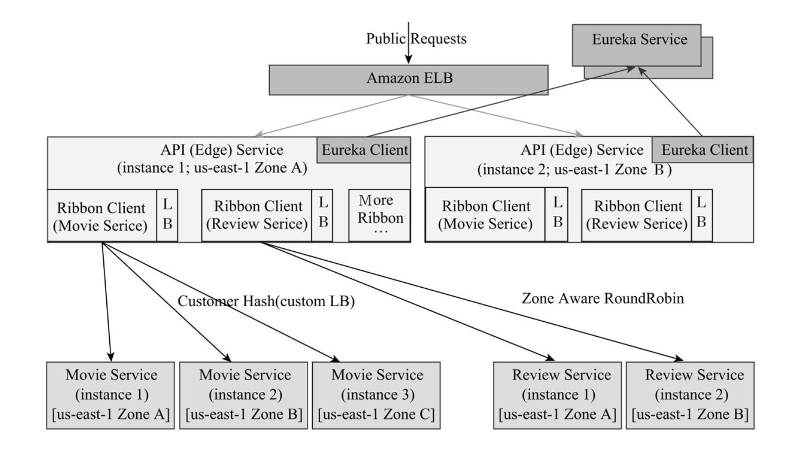

Eureka最初是针对AWS不提供中间服务层的负载均衡的限制而设计开发的。AWS Elastic Load Balancer用来对客户端或终端设备请求进行负载均衡，而Eureka则用来对中间层的服务做服务发现，配合其他组件提供负载均衡的能力。

Netflix为什么要设计Eureka，而不是直接利用AWS Elastic Load Balancer或者AWS Route 53呢？其官方文档说明简要如下：

> 理论上可以使用AWS Elastic Load Balancer对内部进行负载均衡，但是这样就会暴露到外网，存在安全性问题，另外AWS Elastic Load Balancer是传统的基于代理的负载均衡解决方案，无法直接基于服务元数据信息定制负载均衡算法。因此Netflix设计了Eureka，一方面给内部服务做服务发现，另一方面可以结合ribbon组件提供各种个性化的负载均衡算法。

而AWS Route 53是一款命名服务，可以给中间层的服务提供服务发现功能，但它是基于DNS的服务，传统的基于DNS的负载均衡技术存在缓存更新延时问题，另外主要是无法对服务健康状态进行检查，因此Netflix就自己设计了Eureka。

### 在Spring Cloud中使用Netflix Eureka进行服务发现

Netflix Eureka实现了客户端的服务发现，这意味着客户端运行与服务发现服务器Netflix Eureka进行通信的软件，以获取可用的微服务实例的信息。

Spring Cloud提供了与诸如Netflix Eureka之类的服务发现工具通信的抽象，并提供了一个名为DiscoveryClient的接口。通过这个接口，我们可以与服务发现工具进行交互，获取有关可用服务和实例的信息。DiscoveryClient接口的实现还可以自动将Spring Boot应用程序注册到服务发现服务器。

在启动时，Spring Boot可以自动找到DiscoveryClient接口的实现，因此我们只需要引入相应实现的依赖项即可连接到服务发现服务器。对于Netflix Eureka，我们的微服务使用的依赖项是`spring-cloud-starter-netflix-eureka-client`。

通过添加此依赖项，Spring Boot应用程序将具有与Netflix Eureka进行交互的能力。它将自动注册到Eureka服务器，并能够通过DiscoveryClient接口检索其他服务的信息。

通过Spring Cloud和Netflix Eureka，您可以轻松地构建具有服务发现功能的微服务架构，并使各个微服务能够相互发现和协作。

> Spring Cloud还提供了支持使用Apache ZooKeeper或HashiCorp Consul作为服务发现服务器的DiscoveryClient实现。

Spring Cloud还为希望通过负载均衡器向服务发现中注册的实例发出请求的客户端提供了一个抽象接口——LoadBalancerClient接口。标准的响应式HTTP客户端WebClient可以配置为使用LoadBalancerClient的实现。通过在返回WebClient.Builder对象的@Bean声明上添加@LoadBalanced注解，LoadBalancerClient的实现将作为ExchangeFilterFunction注入到Builder实例中。在本章的后面部分，我们将看到一些源代码示例，演示如何使用这个功能。

总结一下，Spring Cloud使得使用Netflix Eureka作为服务发现工具非常简单。通过本文对服务发现及其挑战的介绍，以及Netflix Eureka如何与Spring Cloud配合使用，我们已经准备好学习如何设置Netflix Eureka服务器了。

### 服务发现技术选型

Jason Wilder在2014年2月的时候写了一篇博客《Open-Source Service Discovery》（http://jasonwilder.com/blog/2014/02/04/service-discovery-in-the-cloud/），总结了当时市面上的几类服务发现组件，这里补充上consul以及一致性算法。

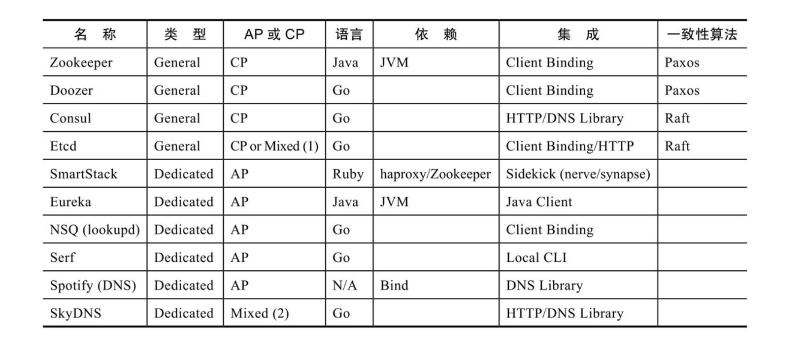

从列表看，有很多服务发现组件可以选择，针对AP及CP，本书主要选取了Eureka及Consul为代表来阐述。关于Eureka及Consul的区别，Consul的官方文档有一个很好的阐述（http://www.consul.io/intro/vs/eureka.html），具体如下：

> Eureka Server端采用的是P2P的复制模式，但是它不保证复制操作一定能成功，因此它提供的是一个最终一致性的服务实例视图；Client端在Server端的注册信息有一个带期限的租约，一旦Server端在指定期间没有收到Client端发送的心跳，则Server端会认为Client端注册的服务是不健康的，定时任务会将其从注册表中删除。
>
> Consul与Eureka不同，Consul采用Raft算法，可以提供强一致性的保证，Consul的agent相当于Netflix Ribbon + Netflix Eureka Client，而且对应用来说相对透明，同时相对于Eureka这种集中式的心跳检测机制，Consul的agent可以参与到基于gossip协议的健康检查，分散了Server端的心跳检测压力。除此之外，Consul为多数据中心提供了开箱即用的原生支持等。


## 设置Netflix Eureka服务器

在本节中，我们将学习如何设置Netflix Eureka服务器进行服务发现。使用Spring Cloud设置Netflix Eureka服务器非常简单，只需按照以下步骤进行操作：

1. 使用Spring Initializr创建一个Spring Boot项目。

2. 添加`spring-cloud-starter-netflix-eureka-server`依赖项。

3. 在应用程序类上添加`@EnableEurekaServer`注解。

4. 添加配置

   ```yaml
   server:
     port: 8761
   
   eureka:
     instance:
       hostname: localhost
     client:
       registerWithEureka: false
       fetchRegistry: false
       serviceUrl:
         defaultZone: http://${eureka.instance.hostname}:${server.port}/eureka/
     # from: https://github.com/spring-cloud-samples/eureka/blob/master/src/main/resources/application.yml
     server:
       waitTimeInMsWhenSyncEmpty: 0
       response-cache-update-interval-ms: 5000
   ```

5. 启动应用

6. 测试

   访问 http://localhost:8761/eureka/apps 可以查看注册的应用。

Eureka在GitHub的wiki上专门写了一篇《Eureka REST operations》来介绍Eureka Server的REST API接口，Spring Cloud Netflix Eureka跟Spring Boot适配之后，提供的REST API与原始的REST API有一点点不同，其路径中的{version}值固定为eureka，其他的变化不大。

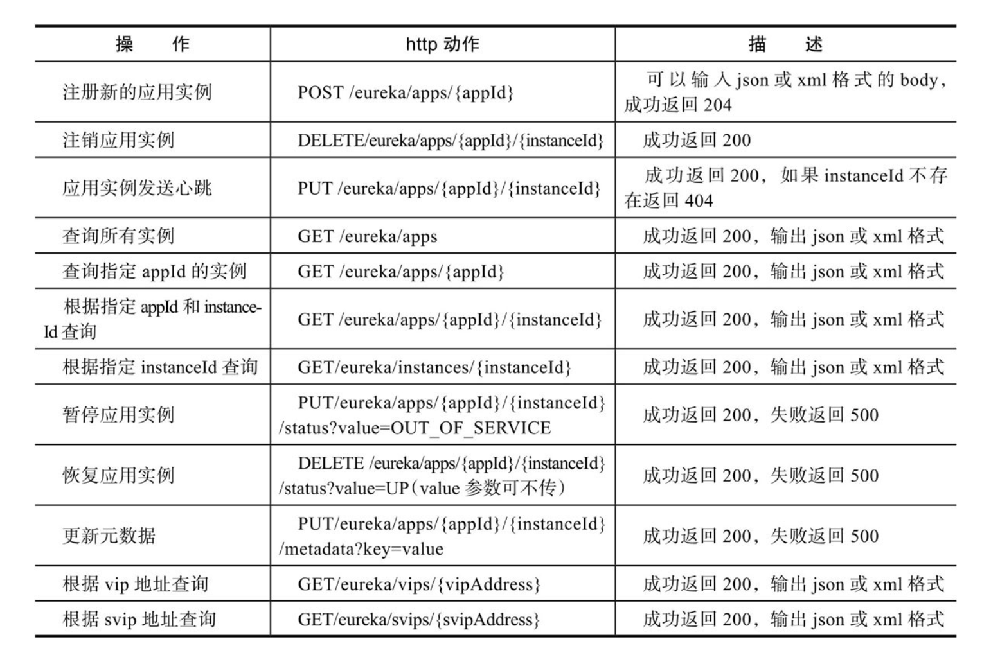

## 为开发使用设置配置

现在，是设置Netflix Eureka作为服务发现工具的最棘手部分：为Eureka服务器和其客户端（即我们的微服务实例）设置工作配置。

Netflix Eureka是一个高度可配置的服务发现服务器，可以为多种不同的用例进行设置，并提供强大、可靠和容错的运行时特性。这种灵活性和强大性的一个缺点是它几乎有无数的配置选项，让人有些眼花缭乱。

幸运的是，Netflix Eureka对于大多数可配置参数都有很好的默认值，至少在生产环境中使用时是如此。

但是，在开发过程中使用Netflix Eureka时，默认值会导致较长的启动时间。例如，客户端要对注册在Eureka服务器中的微服务实例进行初始成功调用可能需要很长时间。

使用默认配置值可能会出现长达两分钟的等待时间。这个等待时间是在Eureka服务和微服务启动时间的基础上增加的。等待时间的原因是涉及的进程需要相互同步注册信息。微服务实例需要向Eureka服务器注册，客户端需要从Eureka服务器获取信息。这种通信主要基于心跳，而默认情况下心跳每30秒发生一次。还涉及了一些缓存，这会减慢更新的传播速度。

在开发过程中，我们将使用一种最小化这种等待时间的配置。在生产环境中，应该将默认值作为起点！

> 在开发环境中，我们只会使用一个Netflix Eureka服务器实例，这是可以接受的。但在生产环境中，您应该始终使用两个或更多实例，以确保Netflix Eureka服务器的高可用性。

### Eureka配置参数

Eureka的配置参数分为三个组：

- Eureka服务器参数，以eureka.server开头。
- Eureka客户端参数，以eureka.client开头。这适用于希望与Eureka服务器通信的客户端。
- Eureka实例参数，以eureka.instance开头。这适用于希望在Eureka服务器中注册自己的微服务实例。

有关这些参数的详细信息，您可以参考Spring Cloud Netflix文档，链接如下：[Spring Cloud Netflix文档](https://docs.spring.io/spring-cloud-netflix/docs/current/reference/html/)。

如果您想要获取可用参数的详尽列表，建议查阅源代码：

- 对于Eureka服务器参数，请查看`org.springframework.cloud.netflix.eureka.server.EurekaServerConfigBean`类获取默认值，并查看`com.netflix.eureka.EurekaServerConfig`接口获取相关文档。
- 对于Eureka客户端参数，请查看`org.springframework.cloud.netflix.eureka.EurekaClientConfigBean`类获取默认值和文档。
- 对于Eureka实例参数，请查看`org.springframework.cloud.netflix.eureka.EurekaInstanceConfigBean`类获取默认值和文档。

通过查阅这些类和接口的源代码，您将找到一个详尽的可用参数列表，包括其描述和默认值。

#### 客户端

基本参数：

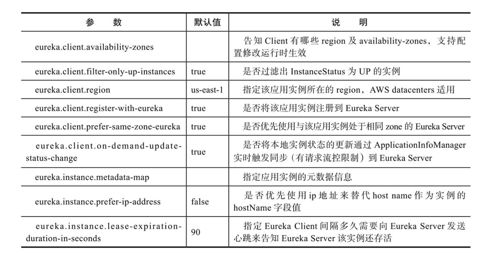

定时任务参数：

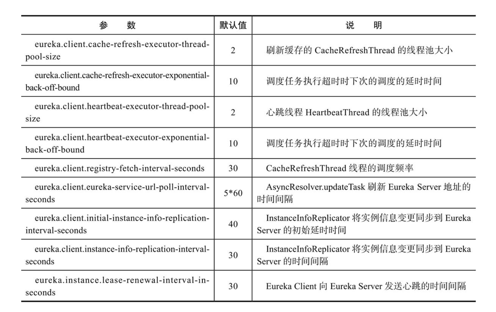

http参数。Eureka Client底层httpClient与Eureka Server通信，提供的相关参数：

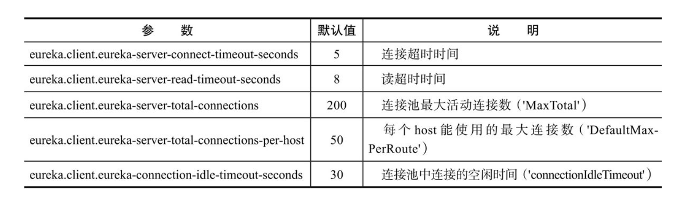

#### 服务端

1. 基本参数：

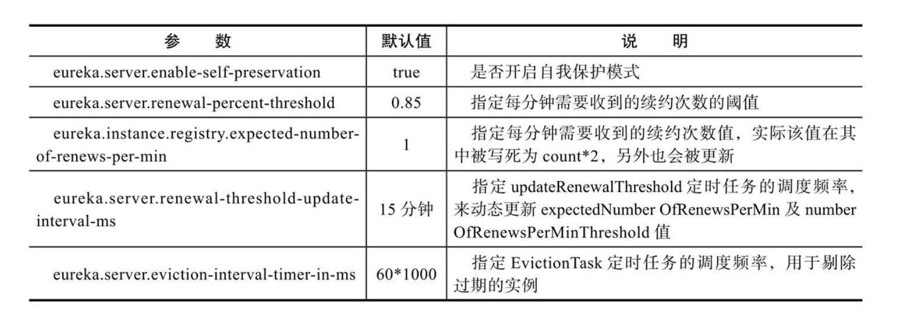

2. response cache参数

Eureka Server为了提升自身REST API接口的性能，提供了两个缓存：一个是基于ConcurrentMap的readOnlyCacheMap，一个是基于Guava Cache的readWriteCacheMap。

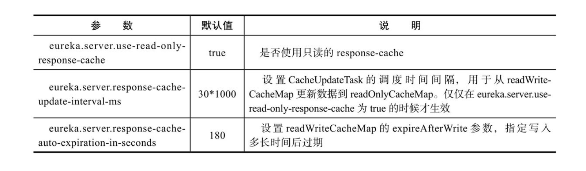

3. peer相关参数

   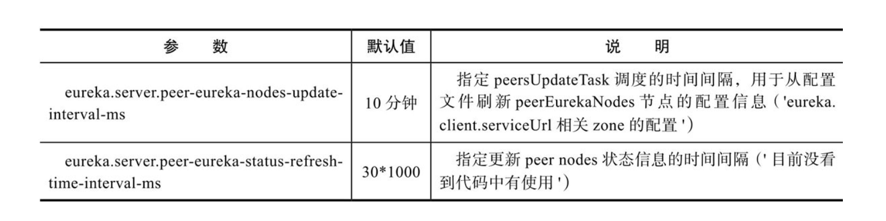

4. http参数

   Eureka Server需要与其他peer节点进行通信，复制实例信息，其底层使用httpClient，提供的相关参数

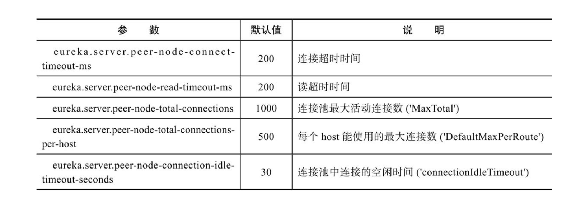

### 参数调优

对于新接触Eureka的开发人员来说，一般会有几个困惑：

- 为什么服务下线了，Eureka Server接口返回的信息还会存在？
- 为什么服务上线了，Eureka Client不能及时获取到？

对于第一个问题，Eureka Server并不是强一致的，因此registry中会存留过期的实例信息，这里头有几个原因：

- 应用实例异常挂掉，没能在挂掉之前告知Eureka Server要下线掉该服务实例信息。这个就需要依赖Eureka Server的EvictionTask去剔除。

- 应用实例下线时有告知Eureka Server下线，但是由于Eureka Server的REST API有response cache，因此需要等待缓存过期才能更新。

- Eureka Server由于开启并引入了SELF PRESERVATION模式，导致registry的信息不会因为过期而被剔除掉，直到退出SELF PRESERVATION模式。

针对Client下线没有通知Eureka Server的问题，可以调整EvictionTask的调度频率，比如下面配置将调度间隔从默认的60秒，调整为5秒：

```yaml
eureka.server.eviction-interval-timer-in-ms: 5000
```

针对response cache的问题，可以根据情况考虑关闭readOnlyCacheMap：

```yaml
eureka.server.use-read-only-response-cache: false
```

或者调整readWriteCacheMap的过期时间：

```yaml
eureka.server.response-cache-auto-expiration-in-seconds: 60
```

针对SELF PRESERVATION的问题，在测试环境可以将enable-self-preservation设置为false：

```yaml
eureka.server.enable-self-preservation: false
```


针对新服务上线，Eureka Client获取不及时的问题，在测试环境，可以适当提高Client端拉取Server注册信息的频率，例如下面将默认的30秒改为5秒：

```yaml
eureka.client.registryFetchIntervalSeconds: 5
```


在实际生产过程中，经常会有网络抖动等问题造成服务实例与Eureka Server的心跳未能如期保持，但是服务实例本身是健康的，这个时候如果按照租约剔除机制剔除的话，会造成误判，如果大范围误判的话，可能会导致整个服务注册列表的大部分注册信息被删除，从而没有可用服务。Eureka为了解决这个问题引入了SELF PRESERVATION机制，当最近一分钟接收到的续约的次数小于等于指定阈值的话，则关闭租约失效剔除，禁止定时任务剔除失效的实例，从而保护注册信息。对于开发测试环境，开启这个机制有时候反而会影响系统的持续集成，因此可以通过如下参数关闭该机制：

在生产环境中，可以把renewalPercentThreshold及leaseRenewalIntervalInSeconds参数调小一点，进而提高触发SELF PRESERVATION机制的门槛，比如：

```yaml
eureka.instance.lease-renewal-interval-in-seconds: 10 #默认30
eureka.server.renewal-percent-threshold: 0.5 #默认 0.85
```


### 指标监控

Eureka 内置了基于 servo 的指标统计，具体详见 EurekaMonitors 类

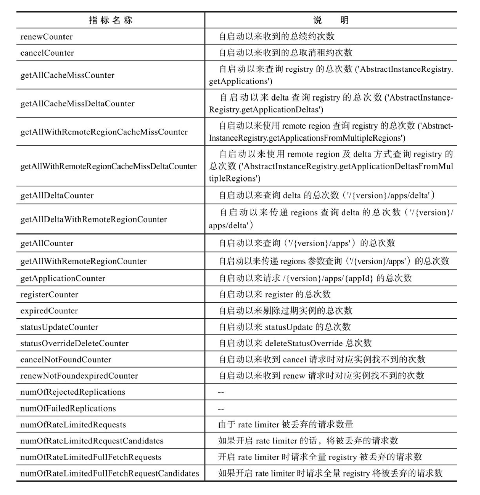

Spring Boot 2.x版本改为使用 Micrometer，不再支持 Netflix Servo，转而支持了Netflix Servo的替代者 [Netflix Spectator](https://github.com/Netflix/spectator)。不过对于Servo，可以通过 `DefaultMonitorRegistry.getInstance(). getRegisteredMonitors()` 来获取所有注册了的Monitor，进而获取其指标值。
